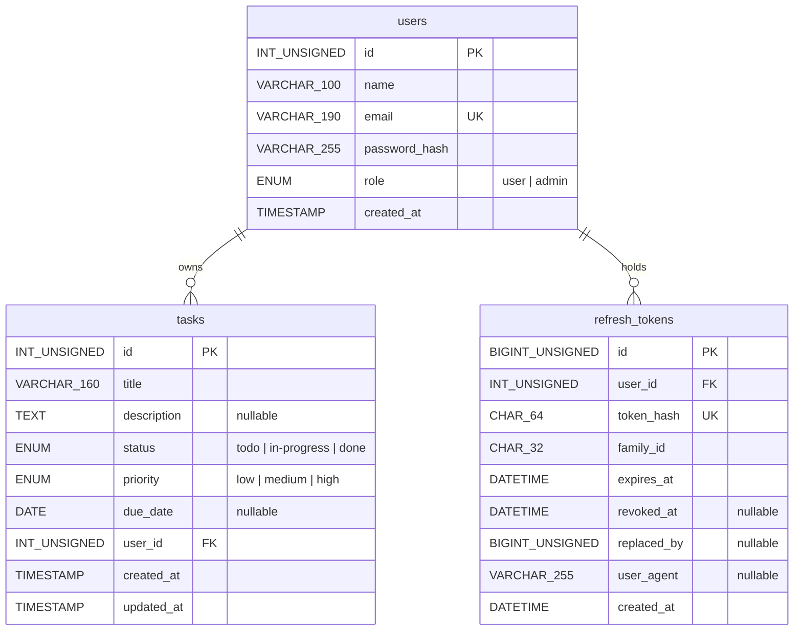

# Schema and query design

The canonical DDL is [`db/init/01_schema.sql`](../db/init/01_schema.sql). This
document explains why it looks the way it does, shows the queries the
application actually issues, and gives the `EXPLAIN` output behind every
indexing decision.

Every measurement here was taken on MySQL 8.0.46 against 500,000 tasks spread
over 2,000 accounts, with a deliberately skewed status distribution (60% done,
20% todo, 20% in progress) because that is what a real backlog looks like. The
[reproduction steps](#reproducing-the-benchmark) are at the end.

---

## 1. The model



Both relationships are one-to-many from `users`, and both foreign keys are
`ON DELETE CASCADE`. Deleting an account is meant to remove that person's work
and sessions with it; the alternative is orphaned rows that every query then
has to defend against.

### Constraints, and what each one is actually preventing

| Constraint | Prevents |
| ---------- | -------- |
| `uq_users_email` | Two accounts sharing an email. Registration checks first for a clean 422, but the unique key is what holds under two concurrent signups, where both checks can pass before either insert lands. |
| `fk_tasks_user` | A task owned by an account that does not exist. Ownership is the entire authorisation model, so a task with a dangling `user_id` is a row nobody can be denied access to. |
| `fk_refresh_tokens_user` | A live session belonging to a deleted account. |
| `uq_refresh_tokens_hash` | Two rows claiming the same token. Rotation depends on a token mapping to exactly one row. |
| `status`, `priority`, `role` as `ENUM` | Any value outside the documented set, including from a direct `mysql` session that never touches the API's validator. |
| `NOT NULL` on `tasks.user_id` | An unowned task. There is no such thing in this model: the server assigns the owner from the caller's token. |

### Why `role` is an ENUM and not a table

The brief asks for users, roles and tasks. Roles here are a one-byte `ENUM` on
`users` rather than a `roles` table, which is a deliberate choice worth
defending rather than glossing over.

A lookup table earns its place when roles carry attributes, when they are
managed at runtime, or when one user can hold several. None of those is true
here. There are exactly two roles, they are fixed at deploy time, and the only
thing the system ever asks is "is this caller an admin?" — a question answered
from the `role` claim in the caller's JWT, not from a database read at all.

So the table would not even be consulted on the hot path. It would be read
once at login and otherwise sit there as an extra join, an extra migration and
an extra thing to keep in sync with the string literals the authorisation code
compares against. The `ENUM` gives the identical integrity guarantee — an
invalid role is rejected by the storage engine — at a lower cost.

The honest cost of this choice: adding a role means `ALTER TABLE`. Appending to
the end of an `ENUM` list is an in-place metadata change in MySQL 8 and is
effectively instant, but inserting a value in the middle rewrites the table.
And `ENUM` cannot express a role hierarchy or per-role permissions at all.

**The trigger to switch** is any of: a third role that needs a description or a
permission set, roles becoming something an administrator edits at runtime, or
a user needing more than one role. At that point the migration is mechanical:

```sql
CREATE TABLE roles (
    id   TINYINT UNSIGNED NOT NULL AUTO_INCREMENT,
    slug VARCHAR(32) NOT NULL,
    name VARCHAR(64) NOT NULL,
    PRIMARY KEY (id),
    UNIQUE KEY uq_roles_slug (slug)
) ENGINE = InnoDB;

INSERT INTO roles (slug, name) VALUES ('user', 'User'), ('admin', 'Administrator');

ALTER TABLE users ADD COLUMN role_id TINYINT UNSIGNED NULL AFTER role;
UPDATE users u JOIN roles r ON r.slug = u.role SET u.role_id = r.id;
ALTER TABLE users
    MODIFY role_id TINYINT UNSIGNED NOT NULL,
    ADD CONSTRAINT fk_users_role FOREIGN KEY (role_id) REFERENCES roles (id),
    DROP COLUMN role;
```

The same reasoning covers `status` and `priority` on `tasks`: closed sets of
three values each, referenced as literals in validation and in the UI, with no
attributes of their own.

### Other column choices

- **`INT UNSIGNED` keys, `BIGINT UNSIGNED` for `refresh_tokens.id`.** Tasks and
  users are bounded by human activity; 4.3 billion is not a ceiling either will
  meet. Refresh tokens are machine-generated and rotate on every use, so that
  table accumulates far faster and gets the wider key.
- **`email VARCHAR(190)`.** Long enough for real addresses and short enough to
  index: 190 × 4 bytes for utf8mb4 fits under the 767-byte prefix limit, which
  matters for anyone still running the older `COMPACT` row format.
- **`password_hash VARCHAR(255)`.** bcrypt emits 60 characters; the headroom is
  for the day `PASSWORD_DEFAULT` becomes argon2id, which is longer.
- **`due_date DATE`, not `DATETIME`.** A deadline of "the 20th" has no time or
  timezone. Storing one invents precision that then has to be stripped in
  every comparison.
- **`updated_at ... ON UPDATE CURRENT_TIMESTAMP`.** Maintained by the database
  so it cannot be forgotten by a code path, or falsified by a client.
- **`utf8mb4` throughout.** `utf8` in MySQL is three bytes and cannot store an
  emoji, which people put in task titles.
- **No index on `users.role`.** Two values across a small table: MySQL would
  correctly ignore it. Listing admins is a full scan of a few thousand rows and
  runs once, from a CLI script.

---

## 2. The queries, and their plans

These are the three shapes the list endpoint compiles to, straight out of
[`TaskRepository`](../api/src/Repositories/TaskRepository.php). The `WHERE`
clause is assembled from whichever filters were supplied, and the server forces
`user_id` into it for non-admins, so a regular user's request can never widen
past their own rows.

### Q1 — a user's own tasks, filtered by status

The single most common request in the application.

```sql
SELECT t.id, t.title, t.description, t.status, t.priority, t.due_date,
       t.user_id, t.created_at, t.updated_at,
       u.name AS owner_name, u.email AS owner_email
  FROM tasks t
  JOIN users u ON u.id = t.user_id
 WHERE t.user_id = 1234 AND t.status = 'todo'
 ORDER BY t.created_at DESC, t.id DESC
 LIMIT 10 OFFSET 0;
```

**Before** — with the original single-column indexes on `user_id` and `status`:

```
-> Limit: 10 row(s)  (actual time=16.7..16.7 rows=10 loops=1)
    -> Sort: t.created_at DESC, t.id DESC, limit input to 10 row(s) per chunk
        -> Filter: ((t.user_id = 1234) and (t.`status` = 'todo'))
            -> Intersect rows sorted by row ID  (actual time=0.101..16.6 rows=53)
                -> Index range scan on t using idx_tasks_user  (rows=250)
                -> Index range scan on t using idx_tasks_status (rows=100182)
```

Two things are wrong. MySQL falls back to an index merge, reading **100,182**
rows off the status index to intersect them against 250 from the owner index —
because `status` has three values, so an index on it alone excludes almost
nothing. Then, having no index that produces rows in `created_at` order, it
sorts the survivors.

**After** — with `idx_tasks_owner_status_created (user_id, status, created_at)`:

```
-> Limit: 10 row(s)  (cost=18.6 rows=10) (actual time=0.0312..0.0474 rows=10 loops=1)
    -> Index lookup on t using idx_tasks_owner_status_created
       (user_id=1234, status='todo') (reverse)  (actual time=0.0264..0.042 rows=10)
```

**16.7 ms → 0.04 ms.** One index seek, ten rows read, no sort node at all. The
`(reverse)` is MySQL walking the index backwards to get `created_at DESC`
without sorting anything.

### Q2 — the admin view: every owner's tasks, with owner details

```sql
SELECT t.*, u.name AS owner_name, u.email AS owner_email
  FROM tasks t
  JOIN users u ON u.id = t.user_id
 WHERE t.status = 'in-progress'
 ORDER BY t.created_at DESC, t.id DESC
 LIMIT 10 OFFSET 0;
```

**Before:**

```
-> Limit: 10 row(s)  (actual time=152..153 rows=10 loops=1)
    -> Nested loop inner join  (cost=79634 rows=170716)
        -> Sort: t.created_at DESC, t.id DESC  (actual time=152..152 rows=10)
            -> Index lookup on t using idx_tasks_status
               (status='in-progress')  (actual time=4.29..114 rows=99709)
```

99,709 rows read and sorted to return ten. This is the pathological pagination
case: the cost is driven by the size of the match, not the size of the page.

**After** — with `idx_tasks_status_created (status, created_at)`:

```
-> Limit: 10 row(s)  (actual time=0.34..0.589 rows=10 loops=1)
    -> Nested loop inner join
        -> Index lookup on t using idx_tasks_status_created
           (status='in-progress') (reverse)  (actual time=0.307..0.309 rows=10)
        -> Single-row index lookup on u using PRIMARY (id=t.user_id)  (loops=10)
```

**153 ms → 0.58 ms**, and the row count is now proportional to the page, not the
match: `rows=10` instead of `rows=99709`. The owner join is ten primary-key
lookups, which is the cheapest access path InnoDB has — and the reason owner
details are joined rather than denormalised onto `tasks`.

### Q3 — the pagination count that runs alongside Q1

`meta.total` has to reflect the same filters as the page, so the endpoint runs
a second query per request. That makes it as hot as Q1 itself.

```sql
SELECT COUNT(*) FROM tasks t WHERE t.user_id = 1234 AND t.status = 'todo';
```

**Before:** the same index-merge intersect, 13.6 ms.

**After:**

```
-> Aggregate: count(0)  (actual time=0.0203..0.0203 rows=1 loops=1)
    -> Covering index lookup on t using idx_tasks_owner_status_created
       (user_id=1234, status='todo')  (actual time=0.00879..0.0166 rows=58)
```

**13.6 ms → 0.02 ms.** *Covering* is the key word: every column the query needs
is in the index, so InnoDB never touches the table rows. The composite index
that fixed Q1 fixed this for free.

### Q4 — task counts per user, for admin reporting

Not currently wired to an endpoint — worth being explicit about, since the rest
of this section is queries the app really runs. Included because it is the
natural next admin view and because it demonstrates a rewrite rather than an
index.

The obvious form groups across the join:

```sql
SELECT u.id, u.name, t.status, COUNT(*) AS total
  FROM users u JOIN tasks t ON t.user_id = u.id
 GROUP BY u.id, u.name, t.status;
```

```
-> Table scan on <temporary>  (actual time=703..704 rows=6000 loops=1)
    -> Aggregate using temporary table
        -> Nested loop inner join  (actual time=0.0563..81.1 rows=500000)
```

704 ms. Grouping by `u.name` drags a users column into the grouping key, so no
index on `tasks` can supply the order and MySQL materialises a temporary table
over all 500,000 joined rows.

Aggregating first, then joining the 6,000 results to `users`, removes the
temporary table:

```sql
SELECT u.id, u.name, c.status, c.total
  FROM (SELECT user_id, status, COUNT(*) AS total
          FROM tasks GROUP BY user_id, status) c
  JOIN users u ON u.id = c.user_id;
```

```
-> Nested loop inner join  (actual time=79.4..81 rows=6000 loops=1)
    -> Table scan on u  (rows=2000)
    -> Index lookup on c using <auto_key0> (user_id=u.id)
        -> Materialize  (actual time=79.3..79.3 rows=6000)
            -> Group aggregate: count(0)
                -> Covering index scan on tasks using
                   idx_tasks_owner_status_created  (actual time=0.0366..49.5 rows=500000)
```

**704 ms → 81 ms.** The aggregate is now a covering scan of
`(user_id, status, created_at)` in exactly the order the `GROUP BY` wants, so it
streams instead of buffering. It still reads every row, which is inherent to
counting everything — if this became a dashboard that loaded on every page view,
the answer would be a summary table maintained by triggers or a periodic job,
not another index.

---

## 3. Indexing rationale

Final index set on `tasks`, and the query shape each one exists for:

| Index | Serves | Measured effect |
| ----- | ------ | --------------- |
| `PRIMARY (id)` | Single-task fetch, update, delete | Clustered; every secondary index carries it as the row pointer |
| `idx_tasks_owner_status_created (user_id, status, created_at)` | Q1, Q3, and every non-admin request | 16.7 ms → 0.04 ms; covering for the count |
| `idx_tasks_status_created (status, created_at)` | Q2, the admin status filter | 153 ms → 0.58 ms |
| `idx_tasks_priority_created (priority, created_at)` | Admin priority filter, same shape as Q2 | — |
| `idx_tasks_created (created_at)` | Admin list, no filter, default sort | 130 ms → 0.06 ms |
| `idx_tasks_title (title)` | Admin sorting by title | 18,629 ms → 0.055 ms |
| `idx_tasks_due_nulls_last ((due_date IS NULL), due_date)` | Admin sorting by due date | 319 ms → 0.10 ms |

Three principles decided the set.

**Column order is filter-first, then sort.** Equality predicates come first, the
`ORDER BY` column last. That is what lets a single index satisfy both and
produce rows already in order — the difference between `rows=10` and
`rows=99709` in Q2. Putting `created_at` earlier would break the equality
lookup; omitting it leaves the filesort in place.

**Low-cardinality columns are never indexed alone.** `status` has three values,
so `idx_tasks_status` excluded roughly two rows in three and pulled the
optimiser into that 100,000-row index merge. As the *first* column of a
composite index, though, `status` is useful, because what follows it is then in
sorted order within each status.

**No index on `user_id` alone.** `idx_tasks_owner_status_created` starts with
`user_id`, and a leftmost prefix satisfies both the lookups and InnoDB's
requirement that a foreign key column be indexed. A separate `idx_tasks_user`
would be redundant — write cost for nothing. Dropping it was accepted without
complaint precisely because the composite covers the constraint.

### What the sort indexes cost

`idx_tasks_title` and `idx_tasks_priority_created` exist only to keep admin
sorting off a large filesort. Measured on the 500,000-row table:

| | Index size | 10,000-row insert |
| - | ---------- | ----------------- |
| Without them | 36 MB | 279 ms |
| With them | 77 MB | 330 ms |

**+41 MB and 18% slower writes** to turn an 18.6-second query into 0.055 ms.
For a task manager, where reads vastly outnumber writes and 18 seconds is an
outage rather than a slow page, that trade is worth making. If writes ever
became the bottleneck the alternative is to stop offering unfiltered sorts to
admins, not to keep the indexes and hope.

### What is deliberately *not* indexed

`updated_at` is sortable through the API but is not exposed in the UI, and has
no index. An admin sorting by it filesorts the whole table. That is a conscious
gap, recorded here rather than discovered later.

It is survivable for regular users for a reason worth stating plainly, because
it is what keeps the index count finite:

```
-- regular user sorting by title, no index on title
-> Limit: 10 row(s)  (actual time=6.73..6.73 rows=10 loops=1)
    -> Sort: t.title, t.id  (actual time=6.72..6.73 rows=10)
        -> Index lookup on t using idx_tasks_owner_status_created
           (user_id=777)  (actual time=0.937..6.34 rows=250)

-- admin, unfiltered, sorting by title
-> Limit: 10 row(s)  (actual time=18629..18629 rows=10 loops=1)
    -> Sort: t.title, t.id  (actual time=18629..18629 rows=10)
        -> Table scan on t  (actual time=0.106..213 rows=500000)
```

A filesort over one owner's 250 rows costs 6.7 ms. The same filesort over
500,000 rows costs **18.6 seconds** — the sort buffer overflows and MySQL merges
through temporary files. The owner predicate narrows the set *before* the sort,
so for non-admins the sort column barely matters. Only the admin's table-wide
views need an ordered index per sort column, which is why the extra indexes are
justified by admin traffic alone.

### `refresh_tokens`

Indexed by how the rotation logic reads it, not speculatively:

| Index | Query |
| ----- | ----- |
| `uq_refresh_tokens_hash` | `findByHash` on every refresh — unique, so one seek, and it enforces one-row-per-token |
| `idx_refresh_tokens_family` | `revokeFamily`, burning a whole lineage when reuse is detected |
| `idx_refresh_tokens_expires` | `pruneExpired`, the periodic cleanup |
| `idx_refresh_tokens_user` | Foreign key, plus revoking every session for one account |

Tokens are stored as SHA-256 hashes in a fixed-width `CHAR(64)`, so a leaked
dump cannot be replayed and the unique index entries are all the same size.

---

## 4. Query tuning, beyond adding indexes

Two changes to the SQL itself mattered more than any single index.

### The `ORDER BY` tie-breaker direction

Pagination needs a total order, or rows with equal sort values can appear on two
pages or on neither. `id` is the tie-breaker. It was originally always
descending:

```sql
ORDER BY t.due_date ASC, t.id DESC     -- mixed directions
```

An index can be read forwards or backwards, but not both at once, so a mixed
ordering cannot be served by one and MySQL falls back to sorting everything:

```
-- ORDER BY due_date IS NULL, due_date ASC, id DESC
-> Sort: (t.due_date is null), t.due_date, t.id DESC  (actual time=319..319 rows=10)
    -> Table scan on t  (rows=500000)

-- ORDER BY due_date IS NULL, due_date ASC, id ASC
-> Index scan on t using idx_tasks_due_nulls_last  (actual time=0.0865..0.1 rows=10)
```

**319 ms → 0.1 ms** from changing one keyword. The tie-breaker now follows the
sort column's direction, which keeps the ordering total while leaving it
expressible as a single index walk.

### Nulls last needs a functional index

Undated tasks sort last, which MySQL does not do natively — `NULL` sorts first
ascending. The ordering is therefore an expression:

```sql
ORDER BY t.due_date IS NULL, t.due_date ASC, t.id ASC
```

A plain index on `due_date` cannot serve an expression, so this needs a
functional index matching it exactly, `((due_date IS NULL), due_date)`, which
requires MySQL 8.0.13 or newer. Worth knowing that the plain `due_date` index
was not helping this query even before the nulls-last change, because the
mixed-direction tie-breaker had already forced a filesort.

### Things that were already right

- **`ORDER BY` columns come from a whitelist**, `TaskRepository::SORTABLE`, which
  maps request values to qualified column names. Order direction is coerced to
  exactly `ASC` or `DESC`. `ORDER BY` cannot be parameterised, so this is the
  only safe way to accept it — and it means the set of possible plans is finite
  and reviewable, which is what made the index analysis above tractable.
- **`COUNT(*)` reuses the page query's `WHERE`**, so `meta.total` cannot drift
  from the rows returned.
- **`LIKE` search escapes `%` and `_`** so a literal underscore is not a
  wildcard. Note that `LIKE '%term%'` cannot use an index at all: it is bounded
  in practice by the owner predicate that precedes it, and a table-wide admin
  search is a full scan. Fixing that properly means a `FULLTEXT` index and
  `MATCH ... AGAINST`, which is a different feature, not a tuning tweak.

### Known limit: deep `OFFSET`

`LIMIT 10 OFFSET n` makes MySQL walk and discard `n` rows, so page 10,000 is
slow no matter how good the index is. It is fine here because the UI pages
through a filtered list a few pages at a time. The fix, if deep paging ever
matters, is keyset pagination — `WHERE (created_at, id) < (:last_created, :last_id)`
— which the existing `(…, created_at)` indexes already support, and which is
another reason the tie-breaker is part of the sort key rather than an
afterthought.

---

## Reproducing the benchmark

The generator and query scripts are not committed; the shape is:

```sql
-- 2,000 users, 500,000 tasks
INSERT INTO tasks (title, description, status, priority, due_date, user_id, created_at)
WITH RECURSIVE seq AS (SELECT 1 AS n UNION ALL SELECT n + 1 FROM seq WHERE n < 500000)
SELECT CONCAT('Task number ', n),
       IF(CRC32(n) % 7 = 0, NULL, CONCAT('Description body for task ', n)),
       CASE WHEN CRC32(n * 3) % 10 < 6 THEN 'done'
            WHEN CRC32(n * 3) % 10 < 8 THEN 'todo' ELSE 'in-progress' END,
       CASE WHEN CRC32(n * 7) % 5 = 0 THEN 'high'
            WHEN CRC32(n * 7) % 5 < 3 THEN 'medium' ELSE 'low' END,
       IF(CRC32(n * 11) % 11 = 0, NULL, DATE_ADD('2026-01-01', INTERVAL (CRC32(n * 13) % 400) DAY)),
       1 + (n % 2000),
       TIMESTAMPADD(SECOND, -(CRC32(n * 17) % 31536000), '2026-09-18 00:00:00')
FROM seq;

ANALYZE TABLE users, tasks;
```

Attribute values are hashed rather than derived from `n` directly, and that
detail is load-bearing. The first version of this generator used `n % 10` for
status while owner was `n % 2000`; since 10 divides 2000, every user ended up
with exactly one status, Q1 matched zero rows, and the whole benchmark was
measuring nothing. Worth checking the distribution before trusting any plan:

```sql
SELECT status, COUNT(*), COUNT(DISTINCT user_id) FROM tasks GROUP BY status;
SELECT status, COUNT(*) FROM tasks WHERE user_id = 1234 GROUP BY status;
```

`ANALYZE TABLE` matters too — the optimiser chooses from statistics, and stale
statistics on a freshly bulk-loaded table produce plans that do not reflect the
data.

Timings are from `EXPLAIN ANALYZE` with a warm buffer pool, taken as the median
of repeated runs against several different users and statuses. First-touch runs
are consistently slower — Q2 measured 6.5 ms cold against 0.4 ms warm — so a
single cold measurement is not evidence of anything.
